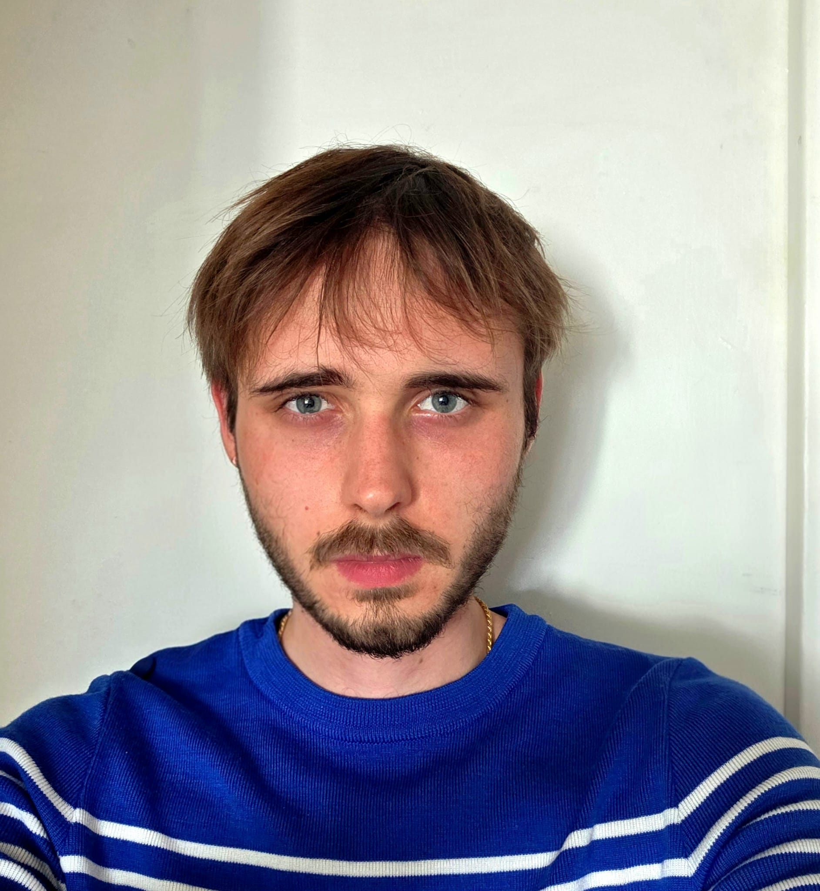

---
# Feel free to add content and custom Front Matter to this file.
# To modify the layout, see https://jekyllrb.com

layout: default
title: Home
order: 1
---

// about me

  Hello! My name is Arthur. I am a Master's student at Columbia focused on numerical methods, stochastic models, and uncertainty quantification.

  I am most interested in building solid mathematical models of complex phenomena.

<!-- Centered Profile Picture Container at the very bottom -->

  <figure style="margin: 0; width: 120px; text-align: center;">
    

      
    

    <figcaption style="font-size: 0.75rem; margin-top: 0.6rem; color: #6a737d; text-transform: uppercase; letter-spacing: 0.05em;">[ ama2409 ]</figcaption>
  </figure>

> current focus
<ul style="list-style-type: '— '; padding-left: 1rem; margin: 0.5rem 0 2.5rem 0;">
  <li><strong style="color: #fff;">PDEs and how to model them</strong></li>
  <li>Predictive modeling and optimization</li>
  <li>Stochastic systems and uncertainty quantification</li>
  <li>Methods for higher-order problems</li>
</ul>

> quick profile
<ul style="list-style-type: '— '; padding-left: 1rem; margin: 0.5rem 0 2.5rem 0;">
  <li><strong style="color: #fff;">education:</strong>
    <ul style="list-style-type: '↳ '; padding-left: 1.2rem; margin: 0.3rem 0; color: #b5cea8;">
      <li>MS @ Columbia — Engineering Mechanics (Computational & Data-Driven Methods)</li>
      <li>MS @ ESTP — Engineering (Civil & Electrical)</li>
      <li>MPSI & MP @ Lycée Janson de Sailly (Pure Math & Physics)</li>
    </ul>
  </li>
  <li><strong style="color: #fff;">experience:</strong> Research modeling in C++/FreeFEM++, large-scale MATLAB simulation, and Python ML & UQ pipelines</li>
  <li><strong style="color: #fff;">interests:</strong> 19th Century Literature & Philosophy, Napoleonic Era History, Chelsea FC</li>
</ul>

  <a href="mailto:ama2409@columbia.edu" style="text-decoration: none; color: #4fc1ff;">email</a> / 
  <a href="https://linkedin.com" target="_blank" style="text-decoration: none; color: #4fc1ff;">linkedin</a> / 
  <a href="https://github.com" target="_blank" style="text-decoration: none; color: #4fc1ff;">github</a>

<!-- Centered Landscape/Scenic Image Container -->

  <figure style="margin: 0; max-width: 400px; text-align: center;">
    
    <figcaption style="font-size: 0.75rem; margin-top: 0.6rem; color: #6a737d; text-transform: uppercase; letter-spacing: 0.05em;">[ fig 01. LE CHATEAU DU HENAN SUR LES RIVES BOISEES DE L'AVEN ]</figcaption>
  </figure>

