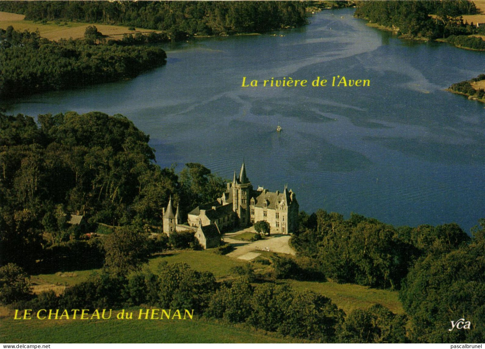
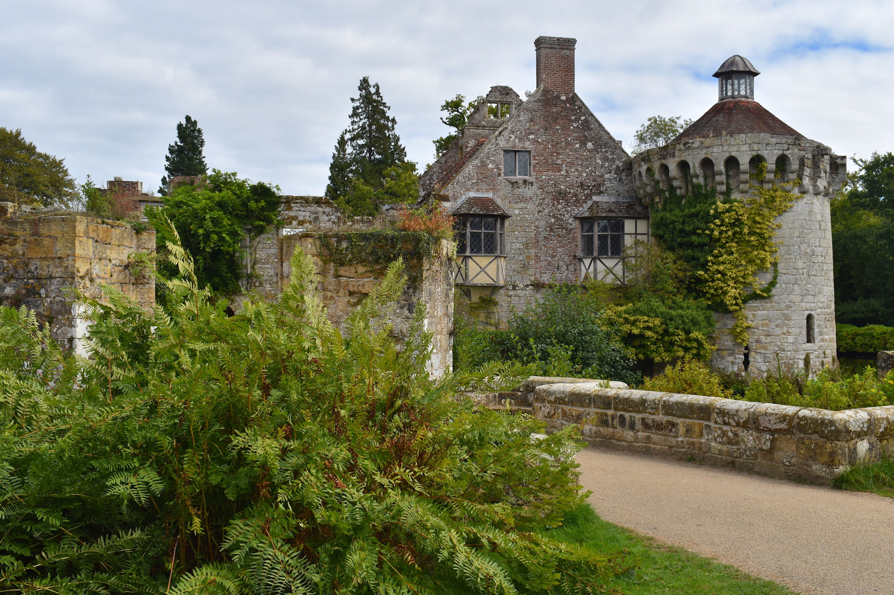

---
# Feel free to add content and custom Front Matter to this file.
# To modify the layout, see https://jekyllrb.com

layout: default
title: Home
order: 1
---

// about me

  Hello! My name is Arthur. I am a Master's student at Columbia focused on numerical methods, stochastic modeling, and computational approaches to engineering problems.

  My passion lies in building and studying mathematical models of complex and ill-posed problems, with a focus on randomness.

<!-- Centered Profile Picture Container at the very bottom -->

  <figure style="margin: 0; width: 120px; text-align: center;">
    

      
    

    <figcaption style="font-size: 0.75rem; margin-top: 0.6rem; text-transform: uppercase; letter-spacing: 0.05em;" class="color-tertiary">[ ME ]</figcaption>
  </figure>

> current focus
<ul style="list-style-type: '— '; padding-left: 1rem; margin: 0.5rem 0 2.5rem 0;">
  <li>Stochastic modeling & Monte Carlo methods</li>
  <li>Numerical methods for PDEs and differential equations</li>
  <li>Large-scale computational simulation and optimization</li>
  <li>Data-driven modeling and uncertainty quantification</li>
  <li>Digital twins</li>
</ul>

> quick profile
<ul style="list-style-type: '— '; padding-left: 1rem; margin: 0.5rem 0 2.5rem 0;">
  <li><strong style="color: #fff;">education:</strong>
    <ul style="list-style-type: '↳ '; padding-left: 1.2rem; margin: 0.3rem 0;" class="color-secondary">
      <li>MS @ Columbia — Engineering Mechanics (Computational & Data-Driven Methods)</li>
      <li>MS @ ESTP — Engineering (Civil & Electrical)</li>
      <li>MPSI & MP @ Lycée Janson de Sailly (Pure Math & Physics)</li>
    </ul>
  </li>
  <li><strong style="color: #fff;">experience:</strong> Research modeling in C++/FreeFEM++, large-scale MATLAB simulation, and Python ML & UQ pipelines</li>
  <li><strong style="color: #fff;">interests:</strong> 19th Century Literature & Philosophy, Napoleonic Era History, Chelsea FC</li>
</ul>

  <a href="mailto:ama2409@columbia.edu" class="link-primary" style="text-decoration: none;">email</a> / 
  <a href="https://www.linkedin.com/in/arthuramalir" target="_blank" class="link-primary" style="text-decoration: none;">linkedin</a> / 
  <a href="https://github.com/arthuramalir" target="_blank" class="link-primary" style="text-decoration: none;">github</a>

<!-- Centered Landscape/Scenic Image Container -->

  <figure style="margin: 0; max-width: 400px; text-align: center;">
    
    <figcaption style="font-size: 0.75rem; margin-top: 0.6rem; text-transform: uppercase; letter-spacing: 0.05em;" class="color-tertiary">[ fig 01. LE CHÂTEAU DU HÉNAN SUR LES RIVES BOISÉES DE L'AVEN ]</figcaption>
  </figure>

  <figure style="margin: 0; max-width: 400px; text-align: center;">
    
    <figcaption style="font-size: 0.75rem; margin-top: 0.6rem; text-transform: uppercase; letter-spacing: 0.05em;" class="color-tertiary">[ fig 02. SCOTNEY CASTLE ]</figcaption>
  </figure>

